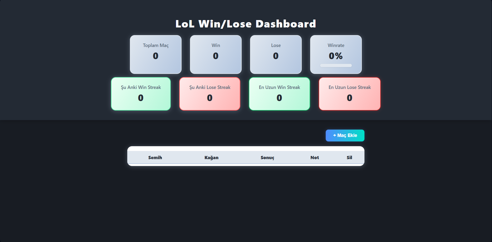

# LoL Win/Lose Dashboard

League of Legends Win/Lose Takip Paneli

## Özellikler
- **Gerçek zamanlı senkronizasyon:** Firebase Realtime Database ile, eklenen/silinen maçlar anında tüm kullanıcıların ekranında güncellenir.
- **Dashboard Panel:** Toplam maç, win, lose, winrate, streak (şu anki ve en uzun win/lose streak) panelleri.
- **Animasyonlu Progress Bar:** Winrate için renkli, animasyonlu bar.
- **Şampiyon İkonları:** Data Dragon üzerinden otomatik çekilen şampiyon ikonları.
- **Maç Listesi:** Tablo şeklinde, her satırda şampiyon ikonları, sonuç, not, silme ve maç linki ikonu.
- **Win/Lose Animasyonları:** Satırda win için yeşil, lose için kırmızı gradient ve animasyon.
- **Not Ekleme:** Her maça kısa not ekleyebilme.
- **Gerçek zamanlı silme ve not güncelleme.**
- **Modern Modal ile Maç Ekleme:** Prompt yerine şık bir açılır pencere (modal) ile maç ekleme formu.

## Kullanım

1. **Siteyi açın:**
   - https://bloodeyes45.github.io/website/
2. **Maç ekleyin:**
   - "+" Maç Ekle" butonuna tıklayın, açılan pencerede karakterleri, sonucu ve maç linkini girin.
3. **Not ekleyin:**
   - Her maç satırında not kutusuna tıklayarak kısa not ekleyebilirsiniz.
4. **Silme:**
   - Satırdaki "Sil" butonuna tıklayarak maçı kaldırabilirsiniz.
5. **Maç linki:**
   - Satırdaki bağlantı ikonuna tıklayarak porofessor maç sayfasını açabilirsiniz.

## Teknik Detaylar
- **Frontend:** HTML, CSS, Vanilla JS
- **Veritabanı:** Firebase Realtime Database (herkes için ortak veri)
- **Şampiyon verisi:** Riot Data Dragon API
- **Deploy:** Github Pages

## Geliştiriciler
- Semih & Kağan 

## Geliştirme & Katkı
- Her güncellemede bu dosya güncellenecektir.
- Yeni özellik isteklerinizi veya bugları issue olarak açabilirsiniz.

---

**Demo:**

---

### Lisans
MIT 
